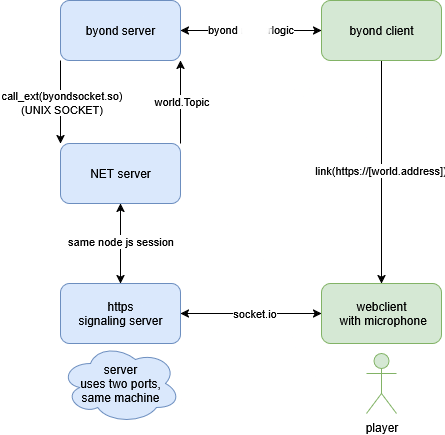

# voice chat byond

## general architecture

* [getUserMedia()](https://developer.mozilla.org/en-US/docs/Web/API/MediaDevices/getUserMedia) requires secure context to run (not http), so for now, Im using bogus certificates to serve over **https**. However it might be possible to serve the site over **byond** with something like `browse_cache("voicechat.html")` and use `link("file:///byond_web_cache_dir/voicechat.html")` instead
* right now distance is calculated at **O(N^2)**, however using a spatial indexing library like [rbush](https://github.com/mourner/rbush), it might be possible to get it down to **O(N * log(N) + idk)**



## building

I dont understand most ss13 build systems so run all at once: **run from project root**

* linux
    ```bash
    sudo apt install npm -y && cd voicechat/pipes && cd ../node && npm install && cd ../..
    ```
* windows
	if you do not have node installed, install it:
	```cmd
	winget install --id OpenJS.NodeJS --disable-interactivity
	```
	and
	```cmd
	cd voicechat/pipes && cd ../node && npm install && cd ../..
	```

## verify it worked
    * to **test node**, run `node voicechat/node/server/main.js`
    * if it worked it should run but with message about missing arguements
	```
	BYOND server listening on TCP port 27000
	ERROR: The search filter cannot be recognized.
	Parent process terminated, shutting down Node.js server
	shutdown_function called
	``
